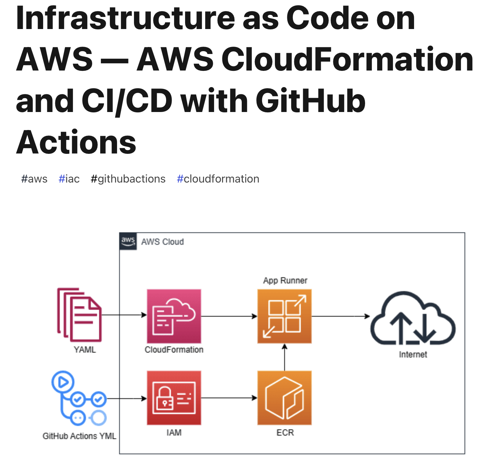
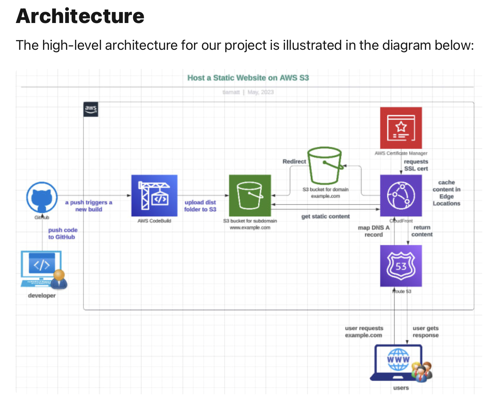

# Solid Network Bank Configuration-as-Code (CaC)

## GitHub Codespace dev container config

### Universal

devcontainer.json
```json
{
  "image": "mcr.microsoft.com/devcontainers/universal:2",

  "onCreateCommand": "git config --global user.name ${GITHUB_USER}"
}
```

### ReactJS

devcontainer.json
```json
{
  "image": "mcr.microsoft.com/devcontainers/universal:2",
  "waitFor": "onCreateCommand",
  "onCreateCommand": "git config --global user.name ${GITHUB_USER}",
  "updateContentCommand": "npm install",
  "postCreateCommand": "",
  "postAttachCommand": {
    "server": "REACT_APP_API_GATEWAY_STAGE=${localEnv:API_GATEWAY_STAGE} npm start"
  },
  "customizations": {
    "codespaces": {
      "openFiles": [
        "src/index.js"
      ]
    }
  },
  "portsAttributes": {
    "3000": {
      "label": "Application",
      "onAutoForward": "openPreview"
    }
  },
  "forwardPorts": [
    3000
  ]
}
```

## CI/CD

### SonarCloud & GitHub Actions integration
- https://github.com/settings/installations lists Integrations such as **SonarCloud**.
- https://sonarcloud.io/organizations/solidnetwork-bank/projects lists GitHub repositories integrated to **SonarCloud**.
- In **SonarCloud** click to add a new **Analyze projects** select the repository, follow the instructions.
- In **Github** add **SONAR_TOKEN** to the repository secrets in Settings > Actions.
- In your repository add **sonar-project.properties** and **.github/workflows/sonarcloud.yml**
- The workflow runs when add new code to a brach through a code commit or a PR.

### AWS CloudFormation & GitHub Actions integration



- **Create IAM IaCAgent user**
  - Run IaC CloudFormation stack templates to create **IaCAgent**
- **Create Key ID and Access Key Secret**
  - In AWS console > IAM > Users > IaCAgent > Security Credentials > Access keys > Create access Key

  - Store both keys in a password manager 
    - AWS Access Key ID
    - AWS Access Key Secret

- **Add AWS Credentials in GitHub Repo** 
  - **IaCAgent** IAM User is only for IaC deployments:

    1. In GitHub, go to “Settings” of the GitHub Repo
    2. Click “Secrets and variables”
    3. Actions
    4. Repository secrets
    5. Click “New repository secret”
    6. Enter the Name & Value for the Secret.
    7. ACCESS_KEY = AWS Access Key ID
    8. ACCESS_KEY_SECRET = AWS Access Key Secret
    9. CAPABILITIES = any capability needed
    10. ANY_OTHER_SECRET_NEEDEED

- **Writing the Job Sequence in GitHub Action**
  - Add a new file in your repo: .github/workflows/cloudformation-action.yml
  - **name:** action name. Keep it simple. Lower case.
  - **on:** It let us define the trigger point of when the job run.
  - **workflow_dispatch:** Allow us to manually trigger to workflow to run again from Actions Tab. To display this button, the code must be merge to main or default branch.
  - **inputs:** Display a form with inputs when Actions are running manually.
  - **jobs:** Define the job to run for this particular action. You could define more than 1 job here.
  - **steps:** Define how to deploy the CloudFormation Stack.
    - Firstly, we checkout the code using **actions/checkout**.
    - Secondly, we use **aws-actions/configure-aws-credentials** to set the Access Key ID and Access Key Secret that we added in the Github Secret.
    - Lastly, we use **aws-actions/aws-cloudformation-github-deploy** to deploy to AWS CloudFormation.

- **Run GitHub Actions**
  - In GitHub, go to Actions > Workflows > Cloudformation > Run workflow.
  - Choose a branch to deploy.
  - Input AWS Region.
  - File path: repo template path to deploy in CloudFormation.
  - Stack name: stack name to be created on CloudFormation.
  - Additional inputs to replace CloudFormation template parameters.

### AWS S3 & GitHub Actions integration
